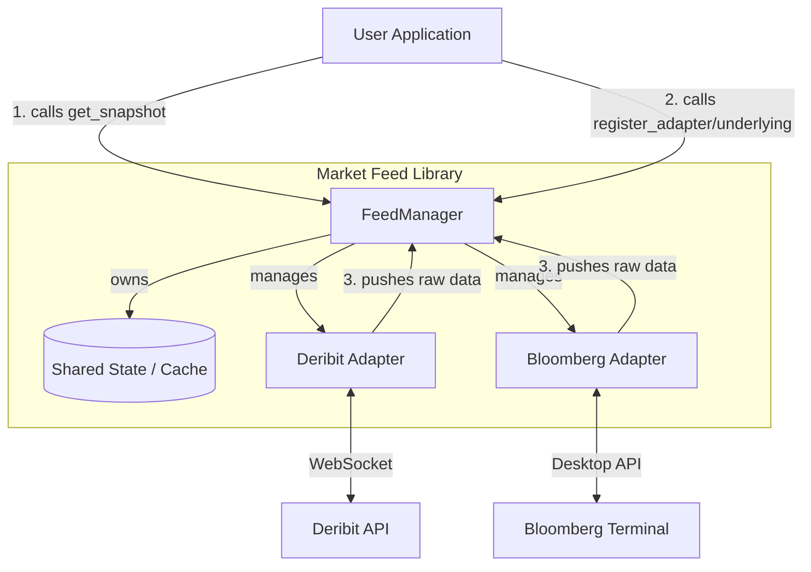

# Market Feed - Developer & Architecture Guide

This guide is written for software engineers and contributors. It explains the internal architecture, the rationale behind design choices, and provides a detailed breakdown of the codebase.

---

## 1. High-Level Architecture

The `market_feed` library is a **multi-threaded market data aggregator**. It connects to multiple crypto/finance exchanges (via WebSockets), normalizes their data formats into a single standard, and provides a thread-safe snapshot to the main application.

### Architectural Diagram

### Core Design Principles

1.  **Centralized State, Decentralized I/O**:
    *   **Why:** Network I/O is slow and prone to blocking. Market data processing needs to be fast.
    *   **How:** Each `ExchangeAdapter` runs in its own thread to handle I/O. They dump data into the `FeedManager`. The `FeedManager` protects the shared state with a lock.

2.  **Normalize Early**:
    *   **Why:** Downstream logic (trading algos, UIs) shouldn't care if data came from Deribit or Bloomberg.
    *   **How:** Adapters act as translators. They convert exchange-specific subscription commands into generic ones, and the `FeedManager` converts incoming raw data into a standardized `ticker` dictionary.

3.  **Bootstrapping vs. Streaming**:
    *   **Why:** WebSockets give updates, but often you need the *initial state* (e.g., list of all option strikes) before you can subscribe.
    *   **How:** The system performs a synchronous HTTP/Reference Data fetch at startup (`get_option_chain`) to build the universe, then switches to async WebSockets for price updates.

---

## 2. Codebase Walkthrough

## 2. Codebase Walkthrough

### A. `src/market_feed/manager.py` (The Brain)

**Class:** `FeedManager`

This is the most complex file. It orchestrates the entire system.

#### Key Functions & Logic

1.  **`__init__`**:
    *   **Action:** Initializes the `threading.Lock()` and the empty state dictionaries (`_tickers`, `_index_prices`).
    *   **Why:** The lock is critical. Without it, an adapter might write to `_tickers` while the user is reading it, causing a crash.

2.  **`register_adapter(source, account)`**:
    *   **Action:** Checks if an adapter for the requested source (e.g., "deribit:account1") exists. If not, creates it.
    *   **Why:** Decouples connection logic from market registration. Handles "Initialization/Connection".

3.  **`register_market(feed_config)`**:
    *   **Action:**
        1.  Verifies adapter exists.
        2.  Updates internal configuration dictionaries.
    *   **Why:** Handles "Telling the Manager we are interested". Pure configuration registration. Does NOT subscribe automatically.

4.  **`initialize_option_chain(register_name)`**:
    *   **Action:** Calls `adapter.get_option_chain()` to populate the list of tradable instruments (`_instruments_by_undl`).
    *   **Why:** Separates the expensive instrument fetch from the connection logic.

5.  **`ingest_ticker(raw_data)`**:
    *   **Action:** The *single point of entry* for data.
        1.  Acquires `self._lock`.
        2.  Finds the existing ticker record (or creates one).
        3.  **Merges** the new data. (e.g., if the update only contains a new `last_price` but no `bid/ask`, we keep the old `bid/ask`).
        4.  Releases `self._lock`.
    *   **Why:** Merging is crucial because many WebSocket feeds send "diffs" (only changed fields) to save bandwidth.

6.  **`get_subscription_map(...)`**:
    *   **Action:** Calculates which instruments *should* be subscribed to based on filters (e.g., "Only strikes between $50k and $60k").
    *   **Why:** Subscribing to *everything* is too expensive (bandwidth/CPU). This allows smart filtering.

### B. `src/market_feed/base.py` (The Contract)

This file defines the **Interface** that all parts of the system must agree on.

| Component | Description | Why it's Important |
| :--- | :--- | :--- |
| `MarketSnapshot` | A `dataclass` holding a frozen copy of the market state (`tickers`, `index_prices`). | **Thread Safety.** When the user asks for data, we give them a *copy*, not a reference to the live object. This prevents "ConcurrentModificationException" style errors in the user's code. |
| `ExchangeAdapter` | An Abstract Base Class (`ABC`). | **Polymorphism.** The `FeedManager` treats all exchanges exactly the same. It calls `.start()`, `.subscribe()`, etc., without knowing if it's talking to Deribit or Binance. |

**Key Abstract Methods:**
*   `start()` / `stop()`: Lifecycle management.
*   `get_option_chain()`: **Bootstrap step.** Asks "What instruments exist?"
*   `subscribe()`: **Runtime step.** Asks "Send me updates for these."
*   `unsubscribe()`: **Runtime step.** Asks "Stop sending me updates for these."

### C. `src/market_feed/adapters/deribit.py` (The Implementation)

**Class:** `DeribitAdapter` (Inherits from `ExchangeAdapter`)

A concrete example of how to talk to a crypto exchange.

*   **`_ws_loop`**: The main thread loop. It connects to the WebSocket and waits for messages.
*   **`_on_message`**:
    *   **Input:** A JSON string from Deribit.
    *   **Process:** Parses JSON -> Extracts `result` or `params` -> Calls `manager.ingest_ticker()`.
    *   **Output:** None (Side effect: Manager state is updated).
*   **`get_option_chain`**:
    *   **Input:** `base_symbol` (e.g., "BTC").
    *   **Process:** Calls Deribit REST API `public/get_instruments`.
    *   **Output:** A list of raw instrument dictionaries.

### D. `src/market_feed/adapters/bloomberg.py` (The Enterprise Implementation)

**Class:** `BloombergAdapter` (Inherits from `ExchangeAdapter`)

Handles the complexity of the Bloomberg Desktop API (`blpapi`).

*   **Correlation IDs**:
    *   **Problem:** Bloomberg is asynchronous. You send a request for "SPY", and later get a message. How do you know it's for "SPY"?
    *   **Solution:** We attach a unique integer ID (`CorrelationId`) to every request. We maintain a map `ID -> TickerName`. When a message comes back, we look up the ID to find the name.
*   **Name Translation**:
    *   **Problem:** Internal app uses `SPY-20FEB26-688-C`. Bloomberg uses `SPY US 02/20/26 C688 Equity`.
    *   **Solution:** Regex-based translation methods (`_convert_to_bbg`, `_parse_bbg_to_app`) convert between the two formats seamlessly.

---

## 3. Data Flow Scenarios

### Scenario 1: Startup & Registration (Verbose)
1.  **User** calls `manager.register_adapter('deribit')`. Manager creates adapter.
2.  **User** calls `manager.register_market({'base_symbol': 'BTC', ...})`.
3.  **User** calls `manager.subscribe_custom('deribit', ['BTC-PERPETUAL'])`.
4.  **Manager** calls `adapter.subscribe(...)` to ensure data flow.
5.  **User (Optional)** calls `manager.initialize_option_chain('BTC')`.
6.  **Adapter** performs HTTP GET to Deribit. Returns list of 1000+ options.
7.  **Manager** stores these in `self._instruments_by_undl`.
8.  **User** calls `start_stream()`, which triggers `adapter.start()`.
9.  **Adapter** spawns a background thread and opens WebSocket connection.

### Scenario 2: Real-Time Update
1.  **Exchange** sends WebSocket frame: `{"instrument_name": "BTC-29DEC23-50000-C", "last_price": 0.05}`.
2.  **Adapter** (`_on_message`) receives this.
3.  **Adapter** calls `manager.ingest_ticker(data)`.
4.  **Manager** locks. Updates `_tickers["BTC-29DEC23-50000-C"]["last_price"]` to `0.05`. Updates timestamp. Unlocks.

### Scenario 3: User Reads Data
1.  **User** calls `feed.get_snapshot()`.
2.  **Manager** locks.
3.  **Manager** performs `copy.deepcopy()` of `_tickers`.
4.  **Manager** unlocks.
5.  **Manager** returns the copy.
6.  **User** iterates over the copy safely, even if updates are arriving in the background.

---

## 4. Extending the Library

### Adding a New Exchange (e.g., Binance)

1.  **Create File:** `src/market_feed/adapters/binance.py`.
2.  **Inherit:** Create class `BinanceAdapter(ExchangeAdapter)`.
3.  **Implement Abstract Methods:**
    *   `get_option_chain`: Call Binance API to get list of symbols.
    *   `subscribe`: Send `{ method: "SUBSCRIBE", params: [...] }`.
    *   `start`: Setup WebSocket connection (use `websocket-client` or `aiohttp`).
4.  **Register:** In `manager.py`, inside `register_adapter`, add a generic `elif source == 'binance':` block to instantiate your new class.

### Adding New Data Fields

1.  **Update Ingestion:** In `manager.py`, `ingest_ticker` function.
    *   Add the new field to the extraction list: `new_val = raw_data.get('my_new_field')`.
    *   Ensure it is merged into `_tickers`.
2.  **Update Snapshot:** If the field is complex (like a nested object), ensure `MarketSnapshot` handles it (deepcopy usually covers this).

---

## 5. Troubleshooting

*   **Missing Data?**
    *   Check `feed_debug.log`.
    *   Ensure `log_level` is set to 2 in `FeedManager`.
    *   Verify `feed_instruments.csv` mappings if using Bloomberg or unusual tickers.
*   **Stale Data?**
    *   Check timestamps in `get_snapshot().tickers[sym]['ts']`.
    *   If timestamps aren't updating, the WebSocket thread might have died. The `is_ready` flag in the snapshot indicates if adapters are connected.
*   **"Lock" Freezing?**
    *   Never put network calls (HTTP/WS) *inside* a `with self._lock:` block in the Manager. That will freeze the entire application. Network calls belong in the Adapters.
